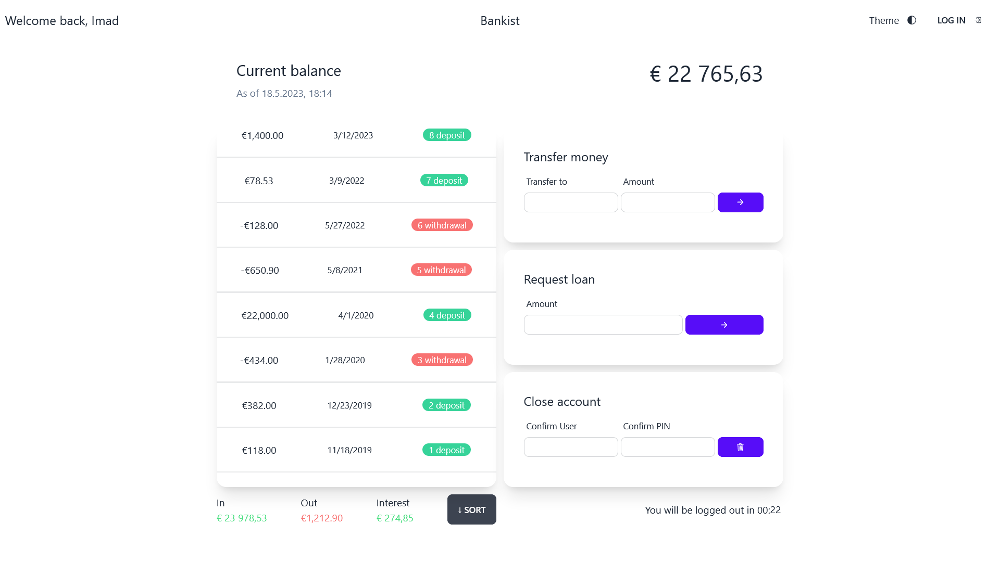

# Bankist

<div align='center'>

  


</div>



You can view the live site -> [Here](https://bankist-imad.netlify.app/)

## Usage

Log-in credentials 👇

| Account   | UserName | Password |
| --------- | -------- | -------- |
| Account 1 | `if`     | `1111`   |
| Account 2 | `js`     | `2222`   |
| Account 3 | `jd`     | `3333`   |

## Description

Bankist is a web-based application that offers multiple features, including the ability to transfer money, view bank details such as deposits and withdrawals, and request loans. Throughout this project, I acquired knowledge in advanced DOM manipulation and various subjects related to array methods and other javascript best practices.

## Features

- Log-in modal window
- Transfer to other accounts
- Request loan
- Delete account
- Sort functionality
- Internationalize date & currency
- Animated log-out timer
- Dark mode
- Responsive design

## Technologies Used

- HTML5
- TailwindCSS
- DaisyUI
- JavaScript

## Installation

To run this project locally, you can follow these steps:

1. Clone the repository:

   ```
   $ git clone https://github.com/imadosan/Bankist.git
   ```

2. Open the project folder in your code editor of choice.
3. Run the following command
   ```
   npm run dev
   ```
4. Open the 'index.html' file in your web browser.

## License

This project is licensed under the MIT License.

## Contact

If you have any questions or comments about this project, you can reach out to me at imad.fayad.if@gmail.com
